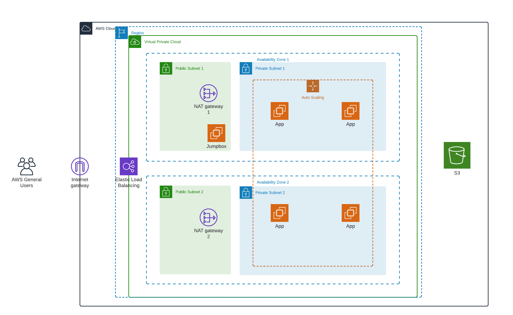
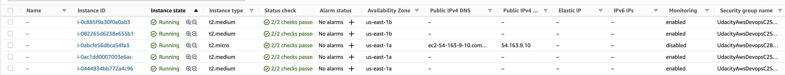
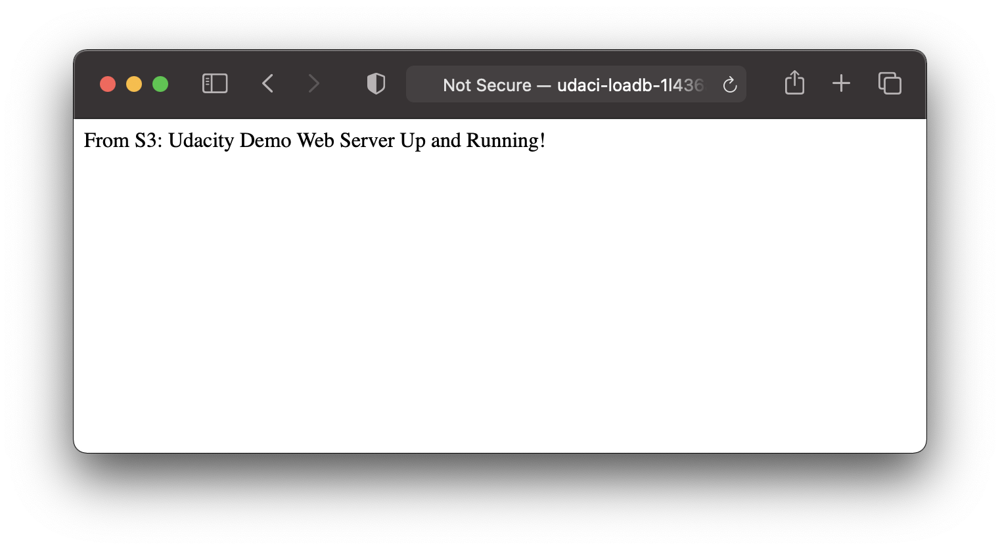
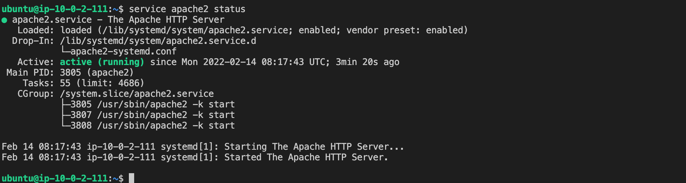

# Udacity Cloud Devops Project 2 - Deploy a high-availability web app using CloudFormation

## Architecture Diagram:



## Getting Started
Deploy S3 bucket
```
aws cloudformation create-stack --stack-name UdacityAwsDevopsC2S3 --template-body file://s3.yml  --parameters file://s3.json --capabilities "CAPABILITY_IAM" "CAPABILITY_NAMED_IAM" --region=us-east-1
```
Upload `index.html` to the bucket. The server user script will look to download this file from the S3 bucket upon startup.

Deploy the network
```
aws cloudformation create-stack --stack-name UdacityAwsDevopsC2Network --template-body file://network.yml  --parameters file://network.json --capabilities "CAPABILITY_IAM" "CAPABILITY_NAMED_IAM" --region=us-east-1
```

Create a keypair to access the bastion server with a name, and update parameter in bastion.json `"ParameterKey": "BastionKeyName"`.

Find your local IP address and update parameter in bastion.json `"ParameterKey": "LocalIP"`.

Deploy the bastion server
```
aws cloudformation create-stack --stack-name UdacityAwsDevopsC2Bastion --template-body file://bastion.yml  --parameters file://bastion.json --capabilities "CAPABILITY_IAM" "CAPABILITY_NAMED_IAM" --region=us-east-1
```

Create a keypair to access the private web servers with a name, and update parameter in servers.json `"ParameterKey": "WebKeyName"`.

Deploy the web server and load balancer
```
aws cloudformation create-stack --stack-name UdacityAwsDevopsC2Servers --template-body file://servers.yml  --parameters file://servers.json --capabilities "CAPABILITY_IAM" "CAPABILITY_NAMED_IAM" --region=us-east-1
```

You should see 4 servers deployed across the 2 availability zones:


Visit load balancer endpoint to confirm the following webpage loads:



The endpoint will be output `LoadBalancerDNS` from the `UdacityAwsDevopsC2Servers` stack.

## Use the bastion server to access the private servers:

Copy the web server key to the bastion server. Get the bastion server public IP from the BastionPublicIp output.
```
scp -i bastion-key.pem web-server-key.pem ec2-user@ec2-bastion-public-ip.compute-1.amazonaws.com:/home/ec2-user
```
SSH into the bastion server and use the key to SSH into the web server. Get the web server private IP from the AWS console after the instances have been created.
```

ssh -i bastion-key.pem ec2-user@ec2-bastion-public-ip.compute-1.amazonaws.com

chmod 400 web-server-key.pem 

ssh -i web-server-key.pem ubuntu@web.server.private.ip
```
Test the web server has been running
```
service apache2 status 
```



## Deleting

In order to delete the resources:

First delete the server stack:
```
aws cloudformation delete-stack --stack-name UdacityAwsDevopsC2Servers --region=us-east-1
```

Then delete the bastion stack:
```
aws cloudformation delete-stack --stack-name UdacityAwsDevopsC2Bastion --region=us-east-1
```

Then delete the network stack:
```
aws cloudformation delete-stack --stack-name UdacityAwsDevopsC2Network --region=us-east-1
```

Then delete the S3 stack:
```
aws cloudformation delete-stack --stack-name UdacityAwsDevopsC2S3 --region=us-east-1
```
Note that the S3 bucket still remains. You will need to empty and delete the bucket manually from the console.

